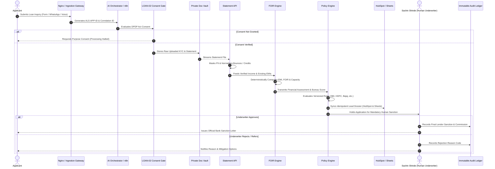

# AVANI LOAN SERVICES — END-TO-END DATA FLOW SPECIFICATION

**Document ID:** `ALS-DOC-DATAFLOW-2026-001`  
**Execution Date:** 09 October 2026  
**Owner:** Sachin Shinde  
**Business Entity:** AVANI LOAN SERVICES  
**Workspace:** `C:\Users\ALPHA-1\Downloads\21MAY2026\SACHIN SHINDE DOCUMENTS\DEVELOPEMENT TOOLS\1-AVANI LOAN SERVICE FY 26-27`  

---

## 1. 15-Stage Underwriting Data Lifecycle

---

## 2. In-Transit Data Transformations

1. **Intake Payload:** Contains unmasked name, phone, loan product, requested amount.
2. **Correlation Tagging:** Assigned unique `CORR-[timestamp]-[rand]` and `ALS-APP-[date]-[rand]` tags.
3. **Consent Enforcement:** If `consentGranted === false`, pipeline terminates immediately with `status: AWAITING_CONSENT`. No external APIs or KYC services are contacted.
4. **Scrubbing & Masking:** PAN is masked to `XXXXX1234X`, Aadhaar to `XXXXXXXX1234`, and account number to `XXXXXXXX1234`.
5. **Statement Parsing:** Raw lines scanned for transaction keywords (`SALARY`, `BOUNCE`, `EMI`). Bounces flagged; verified average income derived.
6. **Mathematical Execution:** FOIR computed as `(Existing EMI + Proposed EMI) / Income`. Available EMI capacity converted to maximum allowable loan principal.
7. **Institutional Rule Matching:** Matched against criteria in `policies/v1/`. Reason codes attached (`MATCH_RECOMMENDED`, `REASON_CIBIL_BELOW_THRESHOLD`, etc.).
8. **Underwriting Quarantine:** Application status locked to `PENDING_HUMAN_UNDERWRITER_APPROVAL`.
9. **Ledger Audit:** Immutable log entry created with hash, timestamp, reviewer identity, and outcome.
